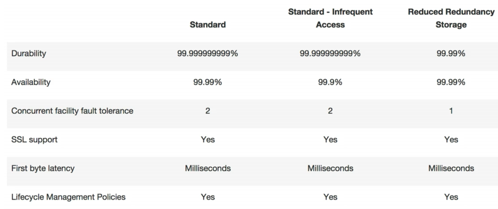

s3
 - object based storage. 
   - key = filename of the object
   - value = data of the file
   - version id = which version is this.
   - metadata = info about the data.
   - subresources
     - access control list(ACL)
     - torrent
 - Other things
   - now compute server
   - must unique filename globally in a bucket.
   - allow to upload files.
   - no server is behind it.
   - 0-5TB limit.
   - unlimited storage
   - file is stored on a bucket.
   - stored in a specific url
     - s3-ru-west-1.amazonaws.com/filename
   
 - 1 data is spread across multiple devices.
 - basic
   - http 200
 - read after write
   - not write in a file immediately
   - take a fraction to sync on other multiple copies.
 - storage tiers
   -  

s3-IA
 - similar to s3 but should be used as infrequently accessed.
s3-Reduced Redundancy Storage
 - data should be easily regenerate
 - cost low.
 - mostly thumbnails.

Glaciers
 - storage for archival.
 - Cost = $0.01 / gigabyte / month
 - retrieval time = 3-5 hours.
 - Charged for:
   - Storage
   - Requests
   - Storage Management Pricing
   - Data Transfer Pricing
   - Transfer Acceleration
     - give a speed bump to the end-user.
     - take advantage by using cloudfront.

~ Continue from video 016.
